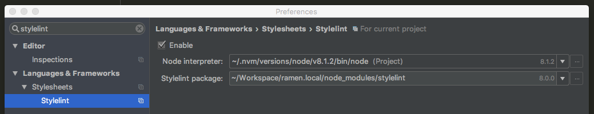

## Installation
Install the required dependencies into your project:

```
npm install --save-dev chefkoch-stylelint-config
```

Create a `.stylelintrc` configuration file in your project root directory with following content:

```
{
  "extends": "chefkoch-stylelint-config"
}
```

## CLI Usage
You are now able to call the command line interface of stylelint:
```
node_modules/.bin/stylelint <path to sccs files>
```

#### Autofixer

With --fix option stylelint will fix as many errors as possible. The fixes are made to the actual source files. 
All unfixed errors will be reported.

Just add `--fix` to the CLI command.

```
node_modules/.bin/stylelint <path to sccs files> --fix
```

## Integration into Gulp Process

You can use the `gulp-stylelint` plugin to integrate `stylelint` into your gulp build process.

```
npm install --save-dev gulp-stylelint
```

We recommend to create a separate linting task. This gives you the opportunity to place it in another composed
task or to run in directly via CLI.

```
var stylelint = require('gulp-stylelint');

gulp.task('style-lint', function() {
    return gulp
        .src(<path to sass files>)
        .pipe(stylelint({
            reporters: [{
                console: true,
                failAfterError: true, // this could be an environment variable
                save: <path to report file>, // found errors will be saved here.
                formatter: 'string'
            }]
        }));
});
```

## Usage with PHPStorm

PHPStorm provides built in functionality for `stylelint`.  Just open `PhpStorm => Preferences` and check the
following settings:




After that is done you should see warnings in your styles, when these do not fit the defined linting rules.

## Testing

If you change/update the linting rules, or update stylelint, please
validate the changes by testing the rules with:

```
npm run test
```

## More Information

You can find more information through the following links:
 
 - [stylelint](https://www.npmjs.com/package/stylelint)
 - [stylelint cli](https://github.com/stylelint/stylelint/blob/HEAD/docs/user-guide/cli.md)
 - [gulp-stylelint](https://www.npmjs.com/package/gulp-stylelint)
 - [real life example ramen](https://jira.chefkoch.de/stash/projects/HAN/repos/ramen/browse)
 
 Have fun!